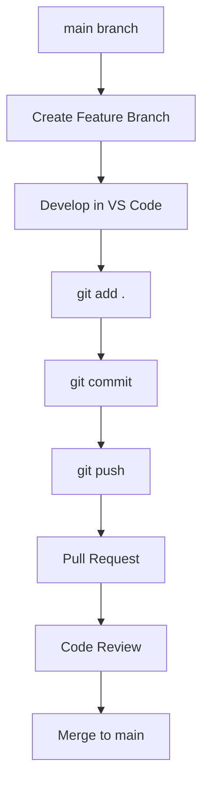

# 🚀 Ultimate Git & GitHub Company Workflow Guide

<p align="center">
  
</p>


> A complete practical guide to learning **Git**, **GitHub**, and **real software company workflows** using hands-on practice.

## 📌 Overview

> This project explains Git & GitHub using a real company scenario where two developers work on the same website project using branches, commits, push, pull requests, and merge process.

### 🏢 Scenario Used

* Company project: `company-website`
* Developer A Task: Add Navbar
* Developer B Task: Add Footer
* Goal: Safely merge all features into `main`

---

## 📌 Overview

## 📚 Table of Contents

* Overview
* Repository Creation
* Clone Workflow
* Git Commands
* Branching Strategy
* Feature Development
* Pull Request Process
* Merge Workflow
* Real Company Flow
* Screenshots Section
* Next Topics

---

## 📌 Overview

This README explains everything learned step-by-step while practicing a real company workflow using **Git**, **GitHub**, and **VS Code**.

We used a sample project:

```text
company-website
├── index.html
└── style.css
```

---

# 1️⃣ Create GitHub Repository

## What is a Repository?

A repository (repo) is the main storage place for your project code.

## What We Did

Created repo:

```text
git-github-workflow-guide
```

## Why Important?

* Stores code online
* Backup of project
* Team collaboration
* Version history

## Output

```text
Repository created successfully
git-github-workflow-guide
```

---

# 2️⃣ Clone Repository to Local System

## Command Used

```bash
git clone https://github.com/VigneshwarNaik/git-github-workflow-guide.git
```

## Meaning

Downloads GitHub project to your computer.

## Why Important?

Developers code locally, not inside browser.

## Next Command

```bash
code .
```

Opens current folder in VS Code.

## Output

```text
Cloning into 'git-github-workflow-guide'...
Receiving objects: 100%
Resolving deltas: 100%
done.
```

---

# 3️⃣ Git Status Command

## Command

```bash
git status
```

## Meaning

Checks current project condition.

## It Shows:

* Current branch name
* Modified files
* Staged files
* Untracked files

## Example

```text
modified: index.html
```

Means file changed.

## Why Important?

Used daily by developers.

## Output

```text
On branch navbar-feature
modified: index.html
```

---

# 4️⃣ Create Branches (Real Company Workflow)

## Why Branches?

Main branch should stay safe.
Developers work in separate branches.

## Command

```bash
git checkout -b navbar-feature
```

## Meaning

* Create branch
* Switch to it immediately

## Branches Used

```text
main
navbar-feature
footer-feature
```

## Output

```text
Switched to a new branch 'navbar-feature'
```

---

# 5️⃣ Edit Code in VS Code

## Navbar Feature Added

```html
<nav>
  <a href="#">Home</a>
  <a href="#">About</a>
  <a href="#">Contact</a>
</nav>
```

## Footer Feature Added

```html
<footer>
  <p>© 2026 Company Website</p>
</footer>
```

## Why Important?

Feature work is done inside branch.

## Output

```text
Navbar code added in index.html
Footer code added in index.html
File saved successfully
```

---

# 6️⃣ Stage Changes

## Command

```bash
git add .
```

## Meaning

Prepare changed files for commit.

## Why Important?

Git only commits staged files.

---

# 7️⃣ Commit Changes

## Command

```bash
git commit -m "Added navbar feature"
```

## Meaning

Save project snapshot with message.

## Why Important?

Commit history helps track work.

## Example Messages

```text
Added navbar feature
Added footer feature
Fixed CSS issue
```

## Output

```text
[navbar-feature abc1234] Added navbar feature
1 file changed, 5 insertions(+)
```

---

# 8️⃣ Push Code to GitHub

## Command

```bash
git push -u origin navbar-feature
```

## Meaning

Uploads local branch to GitHub.

## Terms

* `origin` = GitHub remote repo
* `navbar-feature` = branch name

## Output

```text
Enumerating objects...
Writing objects: 100%
Branch 'navbar-feature' set up to track remote branch.
```

---

# 9️⃣ Pull Request (PR)

## What is PR?

Request to merge branch into main.

## Workflow

```text
navbar-feature → Pull Request → main
```

## Why Important?

* Code review
* Testing before merge
* Safe collaboration

## Output

```text
Compare & pull request created successfully
navbar-feature -> main
```

---

# 🔟 Merge Pull Request

## What Happened

Your branch was merged into `main`.

```text
Pull request successfully merged and closed
```

## Why Important?

Feature officially added to project.

## Output

```text
Pull request successfully merged and closed
```

---

# 1️⃣1️⃣ Pull Latest Main Branch

## Commands

```bash
git checkout main
git pull origin main
```

## Meaning

Move to main and download latest updates.

## Why Important?

Always update before creating next branch.

---

# 🏢 Real Company Workflow Summary



```text
main branch
   ↓
create feature branch
   ↓
code changes in VS Code
   ↓
git add .
   ↓
git commit -m "message"
   ↓
git push
   ↓
Pull Request
   ↓
Review + Merge
   ↓
main updated
```

---

# 🛠 Tools Used

* Git
* GitHub
* VS Code
* HTML
* CSS

---

# 🎯 What I Learned

## Using Real Company Scenario

### Developer A Workflow

```text
main branch
→ create navbar-feature
→ add navbar code
→ commit changes
→ push branch
→ create PR
→ merge to main
```

### Developer B Workflow

```text
main branch
→ git pull latest code
→ create footer-feature
→ add footer code
→ commit changes
→ push branch
→ PR merge
```

### Important Lessons

* Never work directly on main branch
* Use feature branches
* Keep commit messages clear
* Always pull latest main before new branch
* Use Pull Request before merge

## Core Skills Learned

* Git basics
* Branching strategy
* Commit process
* Push / Pull
* Pull Requests
* Merge workflow
* Real company collaboration style

---

# 📚 Next Topics

* Merge Conflicts
* Rebase
* Reset
* Stash
* Cherry-pick
* Team workflows with many developers

---

# 🔥 Advanced Professional Tips

## Best Commit Message Style

```bash
git commit -m "Added navbar feature"
git commit -m "Fixed footer alignment"
```

## Best Branch Naming Style

```text
feature/navbar
feature/footer
bugfix/login-error
hotfix/server-issue
```

## Company Rule

```text
main = production safe branch
develop = testing branch
feature/* = developer branches
```

---


## Why This Project Matters

* Shows practical Git knowledge
* Demonstrates team workflow understanding
* Uses real branching strategy
* Includes pull request experience
* Uses VS Code + GitHub integration

## Skills Demonstrated

```text
Git
GitHub
Version Control
Branching Strategy
Pull Requests
Merge Handling
Team Collaboration
VS Code Workflow
```

---

# 🌟 If You Like This Project

Give this repository a ⭐ on GitHub.

---

# 👨‍💻 Author

**Vigneshwar Naik**

Learning Git & GitHub practically 🚀
